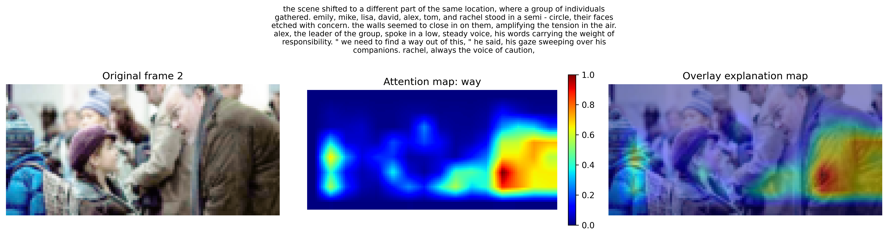
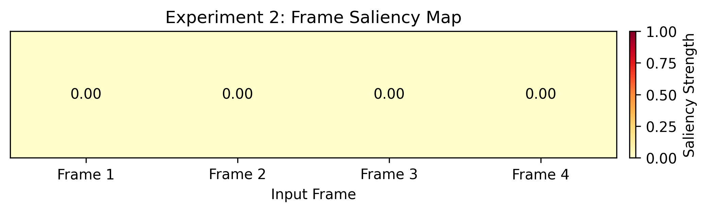

# Visual Storytelling with Cross-Modal Attention and Bi-directional  GRU

In this project there is done improvement in a multimodal grounded sequence prediction of baseline on the `daniel3303/StoryReasoning` dataset. This model recives four story frames and descriptions for each , then prediction is done for the fifth image and description for it.

# Quick Links
- **[Baseline Notebook](experiment_notebooks/baseline.ipynb)**
- **[Experiment 1 Notebook](experiment_notebooks/Experiment_1.ipynb)**
- **[Experiment 2 Notebook](experiment_notebooks/Experiment_2.ipynb)**
- **[Experiment 3 Notebook](experiment_notebooks/Experiment_3.ipynb)**
- **[Baseline Results/Outcomes](Results/baseline/)**
- **[Experiment 1 Results/Outcomes](Results/Experiment_1)**
- **[Experiment 2 Results/Outcomes](Results/Experiment_2/)**
- **[Experiment 3 Results/Outcomes](Results/Experiment_3/)**


# Innovation Summary 

# Experiment-1 (Cross-Modal Attention Grounded Fusion)
I have done changes in the Grounding/fusion part of the baseline architecture. The orginal baseline model have got the simple concatentation where the text latent features and visual latent features are merged together.This procedure blends image and text information, although it doesn't allow the model to clearly understand the relationship within particular words and equivalent visual region. In this experiment Cross-Modal Attention is introduced to enhance the visual-text grounding.The spatial visual feature mapping through the visual encoder function as values and keys, whereas the contextual text token attributes from the LSTM are used as queries.This technique helps the model to concentrate on essential areas of the image, while generating the grounded text visualization. The main aim of this modification is to improve visual-text grounding, lower the referent hallucination as well as to help model to produce text which is better aligned to visual content of the narrative frames.In the outcomes, BLEU-4 score of Cross-Modal Attention is lower than baseline but the final training loss is a slightly higher than the baseline. 

# Attention Overlay



The above figure shows the Cross-Modal Attention explanation for Experiment 1. The left side image represents the selected input frame, the middle image depicts the learned attention intensity for the selected word token, and the right side image overlays the attention map on the original frame. The highlighted red/yellow parts illustrate where the model has higher visual attention when grounding the text representation.

# Main baseline comparison snippet

<table>
<tr>
<th> Baseline: Simple Visual- </th>
<th> Experiment 1 : Cross-Modal Attention Grounded Fusion </th>
</tr>
<tr>
<td>

<pre>
<code class= "language-python">
_, hidden, cell = self.text_encoder(txt_flat)

z_v_seq = z_v_flat.view(batch_size, seq_len, -1)
z_t_seq = hidden.squeeze(0).view(batch_size, seq_len, -1)

z_fusion_flat = torch.cat(
    (z_v_flat, hidden.squeeze(0)),
    dim=1,
)
</code>
</pre>
</td>
<td>

<pre>
<code class= "language-python">
token_embeddings = self.text_encoder.embedding(txt_flat)
lstm_outputs, (hidden, _cell) = self.text_encoder.lstm(token_embeddings)
text_latent = hidden[-1]

visual_feature_map = self.image_encoder.content_backbone.encoder_conv(img_flat)
grounded_visual_flat, cross_attention = self.cross_modal_attention(
    lstm_outputs,
    visual_feature_map,
    token_ids=txt_flat,
)

grounding_strength = torch.sigmoid(self.grounding_gate)
grounded_text_flat = text_latent + grounding_strength * grounded_visual_flat
z_fusion_flat = torch.cat((z_v_flat, grounded_text_flat), dim=1)
</code>
</pre>
</td>
</tr>
</table>

Cross-Modal Attention core:

```python
attention_scores = torch.bmm(queries, keys.transpose(1, 2)) / self.scale
attention_weights = torch.softmax(attention_scores, dim=-1)
attended_visual_tokens = torch.bmm(attention_weights, values)
```

# Experiment-2 (Bidirectional GRU )
I have done changes in the Sequence Predictor component of the baseline architecture. The baseline model used unidirectional GRU to analyze the merged visual-text data.This indicates that the model is only reading the story sequence only in forward direction, from the initial input frame to the final input frame. In this experiment2, I replaced the unidirectional GRU with Bidirectional GRU. It allows the model to process the sequence in both backward and forward directions which read the 4 input frames. Final forward and backward As a outocme, information can be used from the initial phase till end phase of the input sequence by the model while making the final description of the story. The main aim of this modification is to enhance temporal perception and story coherence before forecasting the next frame and text. 

# Main baseline comparison snippet

<table>
<tr>
<th> Baseline: Unidirection GRU </th>
<th> Experiment 2: Bidirectional GRU </th>
</tr>
<tr>
<td>

<pre>
<code class= "language-python">
self.temporal_rnn = nn.GRU(
    fusion_dim,
    latent_dim,
    batch_first=True,
)
self.attention = Attention(gru_hidden_dim)
self.projection = nn.Sequential(
    nn.Linear(gru_hidden_dim * 2, latent_dim),
    nn.ReLU(),
)

zseq, h = self.temporal_rnn(z_fusion_seq)
h = h.squeeze(0)
context = self.attention(zseq)
z = self.projection(torch.cat((h, context), dim=1))
</code>
</pre>
</td>
<td>

<pre>
<code class= "language-python">
self.temporal_rnn = nn.GRU(
    fusion_dim,
    gru_hidden_dim,
    batch_first=True,
    bidirectional=True,
)
self.attention = Attention(gru_hidden_dim * 2)
self.projection = nn.Sequential(
    nn.Linear(gru_hidden_dim * 4, latent_dim),
    nn.ReLU(),
)

zseq, h = self.temporal_rnn(z_fusion_seq)
h = torch.cat((h[-2], h[-1]), dim=1)
context = self.attention(zseq)
z = self.projection(torch.cat((h, context), dim=1))
</code>
</pre>
</td>
</tr>
</table>


# Saliency Map



In experiment 2 sailency map was used for sequence predictor explainability.The main goal was to figure out which predceding frames and image segments were the most important before estimating the subsequent text and frame.This allows to see if the model used the the whole frame record instead of only the latest frame.While sailency maps may be noisy, they are still useful as a basic explanation aid to analyze the model's implementation of temporal visual data. 

# Experiment- 3 ( Bidirectional LSTM )
I have done this experiment to compare BiGRU with the BiLSTM and do the testing whether the LSTM cell state gives superior temporal modeling for story sequence.Baseline Model Sequence predictor was modified, unidirectional GRU is used in baseline after combining the visiual and text latent features. I exchanged the unidirectional GRU with bidirectional LSTM. The BiLSTM retrieves the fused visual-text sequence and analyzes the 4 input frames both backward and forward.In this process the last forward and backward hidden sequence are joined, combined together to attention context vector, as well as then anticipated back within the latent space for text and image prediction.The BiLSTM possesses an extra cellular state and was potentially more robust for long-term sequence storage, while the BiGRU is less complex and has less repetitive gates.In the outcome, BiLSTM achieved almost the identical final training loss as BiGRU.In full validation done as a final results the final training loss of BiGRU and BiLSTM was same, but BiLSTM got slighlty higher on BLUE and METEOR compared with BiGRU. 

# Main baseline comparison snippet

<table>
<tr>
<th> Baseline: Unidirectional GRU </th>
<th> Experiment 3: Bidirectional LSTM </th>
</tr>
<tr>
<td>

<pre>
<code class= "language-python">
self.temporal_rnn = nn.GRU(
    fusion_dim,
    latent_dim,
    batch_first=True,
)
self.attention = Attention(gru_hidden_dim)
self.projection = nn.Sequential(
    nn.Linear(gru_hidden_dim * 2, latent_dim),
    nn.ReLU(),
)

zseq, h = self.temporal_rnn(z_fusion_seq)
h = h.squeeze(0)
context = self.attention(zseq)
z = self.projection(torch.cat((h, context), dim=1))
</code>
</pre>
</td>
<td>

<pre>
<code class= "language-python">
self.temporal_rnn = nn.LSTM(
    fusion_dim,
    gru_hidden_dim,
    batch_first=True,
    bidirectional=True,
)
self.attention = Attention(gru_hidden_dim * 2)
self.projection = nn.Sequential(
    nn.Linear(gru_hidden_dim * 4, latent_dim),
    nn.ReLU(),
)

zseq, (h, _c) = self.temporal_rnn(z_fusion_seq)
h = torch.cat((h[-2], h[-1]), dim=1)
context = self.attention(zseq)
z = self.projection(torch.cat((h, context), dim=1))
</code>
</pre>
</td>
</tr>
</table>

# Standalone Text Autoencoder Pretraining


A standalone text autoencoder pre-trainng step was introduced as a modified training approach.In this phase, the text encoder and decoder were trained simultaneoulsy to rebuild tale details using Cross-Entropy loss.Standalone text autoencoder loss declined invariably from 4.1834 at epoch 1 to 3.8395 at epoch 15. This verifies that the separate text reconstruction task was learning successfully.However, this standalone checkpoint was not used in the baseline or experiment training, so it is reported as supporting work rather than as a direct cause of experiment improvement.This stage was saved independently, it provides evidence for the proposed text pretraining procedure without changing the controlled baseline and experiment results.

# Main Implementation Snippet:

```python
text_dataset = TextTaskDataset(train_dataset)
text_autoencoder = Seq2SeqLSTM(encoder, decoder).to(device)

loss_fn = torch.nn.CrossEntropyLoss(
    ignore_index=tokenizer.convert_tokens_to_ids(tokenizer.pad_token)
)
optimizer = torch.optim.Adam(
    text_autoencoder.parameters(),
    lr=config["training"]["learning_rate"],
)

outputs = text_autoencoder(input_ids, input_ids)
loss = loss_fn(
    outputs.reshape(-1, tokenizer.vocab_size),
    input_ids[:, 1:].reshape(-1),
)
loss.backward()
optimizer.step()
```


# Key Results 

# Baseline vs Experiment 1 vs BiGRU vs BiLSTM

| Metric                 | Baseline  | Experiment 1  | Experiment 2  | Experiment 3   |
|------------------------|-----------|---------------|---------------|----------------|
| Final Training Loss    | 3.9996    | 3.9975        | 3.9957        | 3.9957         |
| BLEU Score             | 0.2015    | 0.2264        | 0.2281        | 0.2301         |
| BLEU-4 Score           | 0.0262    | 0.0312        | 0.0324        | 0.0319         |
| METEOR Score           | 0.1543    | 0.1638        | 0.1667        | 0.1679         |
| Epochs Completed       | 15        | 15            | 15            | 15             |
| Predictions Evaluated  | 710       | 710           | 710           | 710            |


# Findings
Initial when all experiments where done compared to the baseline on 10 epochs, experiment 1 used Cross-Modal Attention, while experiment 2 Used a Bidirectional GRU. The inital output showed that experiment 1 and Experiment 2 have got slightly improved BLUE-4 compared to baseline but the loss was not less than the baseline.

During investigation, I found pretrained text autoencoder was fully frozen. Freezed decoder limited the ability of the model for adaption to the multimodal problem when the sequence predictor produces the intended description utilizing the text decoder.Therefore, I kept the text encoder frozen however allowed the text decoder to train. This adjustement decreased the model's entire training loss. The BLUE-4 and final trainning loss of baseline was accurate after that and the experiment 1 and experiment 2 have got changes. experiment 1 got slightly improved BLUE-4 than baseline and final trainning loss was slightly higher  while on other hand experiment 2 have both BLUE-4 and final training loss worse than baseline.

The experiments were not giving the better results so, the epoch for training were increased.The slight loss reduced experiment 1 and in experiment 2 ,indicating Cross-Modal Attention and BiGRU had the capacity to optimize the  training goal moderately superior than the baseline with additional training time.Neverthless, BLUE-4 reduced for both experiments.Basleline got highest BLUE-4 than experiment 1 and 2 This occured while BLUE-4 is determined from the end of the produced sentence, although the training loss is determined with teacher forcing, where the model obtains the proper prior words.Hence, the model can decrease token-level loss however still produce wording that departs from the orginal text.This clearly shows that the lower training loss will not always  necessarily lead into superior text output. 

Similarly, experiment 3 got better less BLUE-4 than experiment 2 while its final training loss was a bit higher. But after training 15 epochs , BiLSTM achieved a same loss to BiGRU, yet its BLUE-4 dropped . It indicates that although extended training increased teacher-forced reduction, it have no impact on published text during BLUE-4 analysis.

To get an depth evaluation of text quality, BLUE and METOR scores were obtained in the final analysis with BLUE considering general word overlap and METEOR focusing recall and semantic parallelism.

The table below shows 20 validiation prediction was done the baseline seems to be the strongest in all metric ut later when it was done as null and check as full validation check it got better results as shown in the key results. 


| Metric                | Baseline | Experiment 1 | Experiment 2 BiGRU | Experiment 3 BiLSTM |
|-----------------------|----------|--------------|--------------------|---------------------|
| Final Training Loss   | 3.9996   | 3.9976       | 3.9957             | 3.9957              |
| BLEU Score            | 0.2736   | 0.2618       | 0.2627             | 0.2516              |
| BLEU-4 Score          | 0.0244   | 0.0212       | 0.0133             | 0.0000              |
| METEOR Score          | 0.1668   | 0.1603       | 0.1485             | 0.1481              |
| Epochs Completed      | 15.0000  | 15.0000      | 15.0000            | 15.0000             |
| Predictions Evaluated | 20.0000  | 20.0000      | 20.0000            | 20.0000             |

Overall, the outcome demonstrate that BLEU, BLUE-4 or METEOR scores not always get improved by reducing training loss.This is becasue training loss is intended utilizing teacher forcing. Comparing between BLUE, BLUE-3 and METEOR, BLUE-4 is specifically strict becasue it needs exact 4 word phase matches.On, the other hand METEOR and BLUE gives huge information about semantic similarity and word overlap.Moreover, when full validation is done the reulst indicatest that all three experiments changed and had go better result over the baseline.While Experiment 2 was strongest for BLUE and on other hand experiment 2 has got better in BLEU and METEOR.Although the experiments have got only small difference than final loss of baseline.

# How to Reproduce

1. `pip install - r requirements.txt`
2. Open `experiment_notebooks`folder
3. Run the notebooks sequentially start from baseline (Takes around 40/50 minutes for each notebook on GPU)


# AI Transparency

In this project, I used AI as the permitted use of Artificial Intelligence under SHU AI Transparency (AITS), AITS-2 was used for shaping the project. I took ideas from the chatgpt, Google AI mode and copilot  to do experiments. I did research about the training models and about the training loops. I took the help of chatgpt to get ideas how to illustrate the models outcome and how to use some of the libraries and how to implement them. While this project was based on experiments so i tried some of the ideas given by chatgpt.While doing coding and implemeting the models i was getting the erros, but i took help of Goolge AI , Chatghpt as tutor like asking the ideas to solve problem. My experiments were not being improved and not getting the better results. While all experiments were failing and i took some ideas. Hence, the whole project is done in my own there was no use of AI to do any part of the project.   